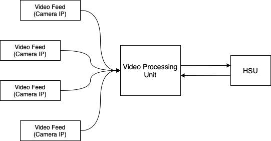
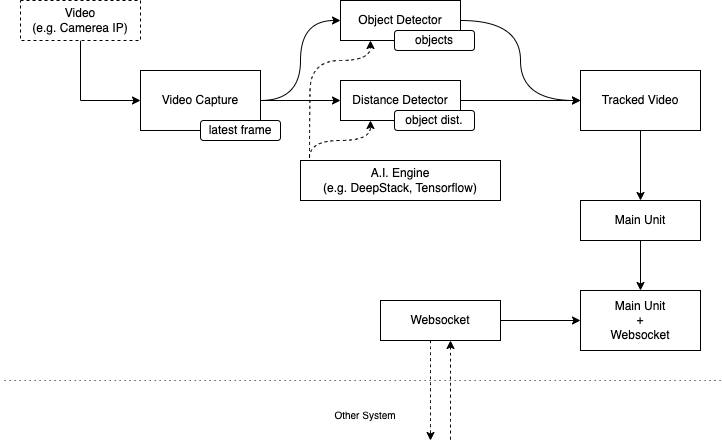

# Video Processing Unit - VPU
[](https://github.com/charles-eyes-ba/video-processing-unit/actions/workflows/python-test.yml)
[](https://www.python.org/downloads/release/python-360)


The Video Processing Unit (A.k.a VPU) is the module that run the classification algorithms on the video feeds.

## Architecture 

### Application

The VPU is a module that among several that represent the Home Security application. The diagram below represents the components that directly interact with the VPU in the application's macro architecture.

<br/>
<p align="center">
  
</p>


### Project

This diagram represents a bit of the architecture of how the VPU was built. It has 3 main components, these being: Frame Collector, Detector and the Video Processing Unit (VPU).

<br/>
<p align="center">
  
</p>

- __Frame Collector__: This component ensures that the most recent frame of a video feed is always available. For each video feed it is created.
- __Detector__: This component obtains the most recent frame made available by video capture and detects the objects present in the frame. This process keeps repeating itself with a delay. For each prediction it informs the VPU that there have been new detections.
- __Video Processing Unit__: This component manages several detectors, one for each video feed provided. The detections or errors will be transferred to the Home Security Unit (HSU). This is where detectors are created or removed. All this communication with the HSU is done via Websocket.

## Tests Notes

The Project was divided into 4 main modules: common, domain, external and factory. Each of them has a well-defined purpose, but the only one covered by unit testing is the domain (removing interfaces). A brief explanation of each module:

- __Common__: This module has several usefuls and constants (like paths) that can be used in other modules.
- __Domain__: This module implements the main components mentioned. It has all the business rules of the application and is not responsible for integrating with frameworks (ex: _OpenCV_ and _SocketIO_).
- __External__: This module implements wrappers of some frameworks. For example: here is the video capture to integrate with _OpenCV_ and be able to read the frames provided by an ip camera.
- __Factory__: This module provides a factory to get an instance of an implementation of the interfaces declared in the project.

## Main Dependencies

| Module | Version |
| --- | --- |
| [OpenCV](https://github.com/opencv/opencv-python) | 4.5.4.60 |
| [Socket.IO](https://github.com/miguelgrinberg/python-socketio) | 5.5.0 |
| [Dotenv](https://github.com/theskumar/python-dotenv) | 0.19.2 |

## Setup

Create a `.env` file following the `.env.example` file.

### Install Dependencies

It is recommended that a virtual environment be used for the project. If you want to use venv, just type:

```shell
$ python -m venv .venv
```

And to start virtual environment:

```shell
$ source .venv/bin/activate
```

To install dependencies:

```shell
$ pip install -r requirements.txt
```

### Start 
To start the VPU, you can do this with following command (run `__main__.py`):

```shell
$ python .
```

## Debugging
- Show the video feed with boxes

```python
import src.factory.dnn_factory as dnn_factory
from src.common.dnn_paths import YOLO_CLASSES_PATH, YOLO_CONFIG_PATH, YOLO_WEIGHTS_PATH
import cv2

cams = [cv2.VideoCapture(0)]
dnn = dnn_factory.create_dnn(YOLO_CONFIG_PATH, YOLO_WEIGHTS_PATH, YOLO_CLASSES_PATH)

while True:
    for index, camera in enumerate(cams):
        ret, frame = camera.read()

        if not ret:
            continue
        
        boxes, scores, classes = dnn.predict(frame)
        dnn.show_img_with_boxes(str(index), frame, boxes, scores, classes, scale=2)
            
    if cv2.waitKey(1) & 0xFF == ord('q'):
        break
```
