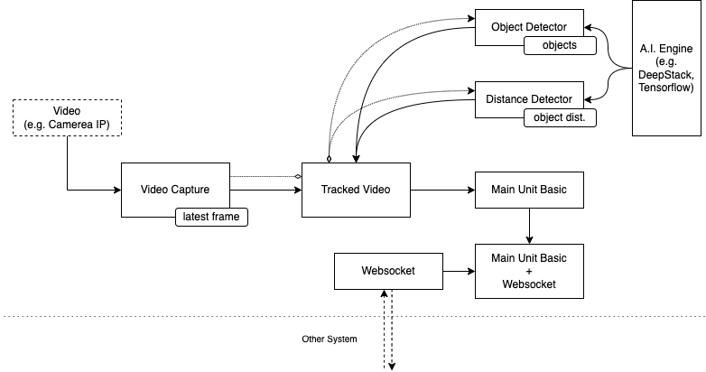

# Video Processing Unit - VPU
[](https://github.com/charles-eyes-ba/video-processing-unit/actions/workflows/python-test.yml)
[](https://www.python.org/downloads/release/python-360)


The Video Processing Unit (A.k.a VPU) is the module that process the image from any video source. The proposal is extract some information from the video and provider those data to another system. 

## Architecture 

### Application

This diagram represents a bit of the architecture of how the VPU was built. 

<br/>
<p align="center">
  
</p>

> The dashed box (Video) represents a video source outside from the system.

- __A.I. Engine__:
- __Video Capture__: 
- __Object Detector__: 
- __Object Distance__: 
- __Tracked Video__: 
- __Main Unit__: 
- __Websocket__: 
- __Main Unit + Websocket__: 

## Tests Notes


## Main Dependencies

| Module | Version |
| --- | --- |
| [Socket.IO](https://github.com/miguelgrinberg/python-socketio) | 5.5.0 |
| [Dotenv](https://github.com/theskumar/python-dotenv) | 0.19.2 |

## Setup

Create a `.env` file following the `.env.example` file.

### Install Dependencies

It is recommended that a virtual environment be used for the project. If you want to use venv, just type:

```shell
$ python -m venv .venv
```

And to start virtual environment:

```shell
$ source .venv/bin/activate
```

To install dependencies:

```shell
$ pip install -r requirements.txt
```

### Start 

To start the VPU, you can do this with following command (run `__main__.py`):

```shell
$ python .
```

## WebSocket Message

- Send video feed ids:
```json
[
  {
    "id": "camera_1",
    "detector_status": "RUNNING"
  },
  {
    "id": "camera_2",
    "detector_status": "ERROR"
  },
]
```

- Send detections:
```json
{
  "id": "camera_1",
  "objects": [
    "car",
    "car",
    "person"
  ]
}
```

- Send error:
```json
{
  "id": "camera_1",
  "error": "Something went wrong"
}
```

- Receive new video feed list:
```json
[
  {
    "id": "camera_1",
    "url": "http://camera.1",
    "config": {
      "run_detection": true
    }
  }
]
```

- Receive to add video feed:
```json
{
  "id": "camera_1",
  "url": "http://camera.1",
  "config": {
    "run_detection": true
  }
}
```

- Receive to remove video feed:
```json
{
  "id": "camera_1"
}
```

- Receive a message to update video config:
```json
{
  "id": "camera_1",
  "config": {
    "run_detection": false
  }
}
```